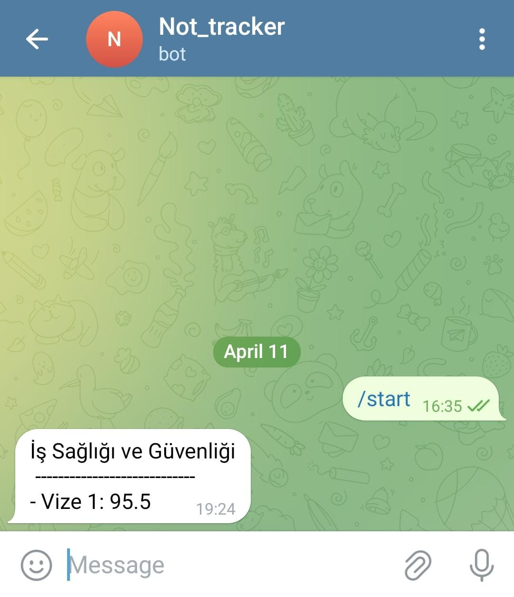

# 🎓 Not Tracker Bot

This is a Python-based Telegram bot that automatically checks your exam results.

## ✨ Features

- Extracts and monitors your exam results
- Sends a Telegram message when a new grade is published
- Works in the background (headless mode)
- Saves previous state to avoid duplicate notifications

## ⚙️ Requirements

- Python 3.10+
- Google Chrome
- ChromeDriver (matching your Chrome version)
- Python packages:
  - selenium
  - pyyaml
  - requests

Install dependencies using:

```bash
pip install selenium pyyaml requests
```

## How to run
1. In your terminal run
```bash
git clone https://github.com/Hudakasim/not_tarcker.git
```

3. you should have your telegram CHATBOT TOKEN and CHAT ID
   You can watch this YouTube video for help:

    [📺 How to Create Telegram Bot & Get Chat ID](https://youtu.be/l5YDtSLGhqk?si=cVAS_fpAjCxOhXOx)

5. Edit the to_change.yaml file with your own information

6. finally, run the bot
   ```bash
   python3 start.py
   ```
   or(depending on your system)
   ```bash
   python start.py
   ```
## ✅ Example Telegram Message


## 🤝 Acknowledgements
💡 This project was inspired by [umutkavakli](https://github.com/umutkavakli/grade-notification-bot)
